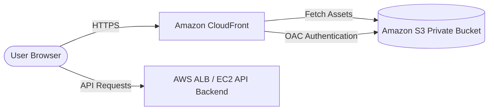

# AWS S3 and CloudFront Deployment Guide for LifeBase Client

This guide provides step-by-step instructions on deploying the React (Vite) client application to AWS using **Amazon S3** (hosting static assets) and **Amazon CloudFront** (Global Content Delivery Network with SSL).

---

## Architecture Overview



To optimize security and performance, we configure:
1. A **Private S3 Bucket** (blocking all public access).
2. **CloudFront Origin Access Control (OAC)** to permit CloudFront to read assets from S3 securely.
3. **CloudFront Custom Error Responses** to support SPA routing (redirecting 403/404 to `/index.html` with a `200 OK` status).

---

## Phase 1: AWS Setup (Console)

### Step 1: Create the S3 Bucket
1. Log in to the AWS Console and navigate to **S3**.
2. Click **Create bucket**.
3. **Bucket name**: e.g., `lifebase-client-prod` (must be globally unique).
4. **AWS Region**: Select your closest region (e.g., `us-east-1` or `ap-south-1`).
5. **Object Ownership**: Leave as **ACLs disabled (recommended)**.
6. **Block Public Access settings**: Keep **Block all public access** checked (this keeps the bucket secure).
7. Click **Create bucket**.

### Step 2: Create a CloudFront Distribution
1. Navigate to **CloudFront** in the AWS Console.
2. Click **Create distribution**.
3. **Origin**:
   - **Origin domain**: Select your S3 bucket from the list.
   - **Origin access**: Select **Origin access control settings (recommended)**.
   - Click **Create new OAC** (leave defaults, click Create).
4. **Default cache behavior**:
   - **Viewer protocol policy**: Select **Redirect HTTP to HTTPS**.
   - **Allowed HTTP methods**: Select `GET, HEAD` (standard for frontend files).
5. **Web Application Firewall (WAF)**: Choose **Do not enable security protections** (or select an existing WAF if needed for your company guidelines).
6. **Settings**:
   - **Price class**: Choose *Use all edge locations* or *Use only North America and Europe* depending on budget/users.
   - **Alternate domain name (CNAME)**: Add your custom domain (e.g., `app.lifebase.com`) if you have one.
   - **Custom SSL certificate**: If using a custom domain, select or request an SSL certificate from AWS ACM (must be requested in `us-east-1`).
   - **Default root object**: Type `index.html`.
7. Click **Create distribution**.
8. **Save S3 Policy Alert**: CloudFront will display a banner: *"The S3 bucket policy needs to be updated..."*. Click **Copy policy** — we will use it in Step 3.

### Step 3: Configure S3 Bucket Policy
1. Go back to your S3 bucket page -> **Permissions** tab -> **Bucket policy** section.
2. Click **Edit**.
3. Paste the bucket policy copied from CloudFront (OAC permission policy). It will look similar to this:
   ```json
   {
       "Version": "2008-10-17",
       "Id": "PolicyForCloudFrontPrivateContent",
       "Statement": [
           {
               "Sid": "AllowCloudFrontServicePrincipal",
               "Effect": "Allow",
               "Principal": {
                   "Service": "cloudfront.amazonaws.com"
               },
               "Action": "s3:GetObject",
               "Resource": "arn:aws:s3:::lifebase-client-prod/*",
               "Condition": {
                   "StringEquals": {
                       "AWS:SourceArn": "arn:aws:cloudfront::123456789012:distribution/E1234567ABCDEF"
                   }
               }
           }
       ]
   }
   ```
4. Click **Save changes**.

### Step 4: Configure SPA Routing in CloudFront
Because the client is a Single Page Application (using React Router), requests to routes (e.g., `/dashboard` or `/login`) don't exist as physical files in S3. S3 will return a `403 Forbidden` or `404 Not Found` error. We must configure CloudFront to route these back to `/index.html`.
1. Go to your CloudFront distribution -> **Error pages** tab.
2. Click **Create custom error response**.
3. **HTTP error code**: Select **403: Forbidden**.
4. **Customize error response**: Select **Yes**.
5. **Response page path**: Enter `/index.html`.
6. **HTTP response code**: Enter **200: OK**.
7. Click **Create**.
8. Repeat the process for **404: Not Found**:
   - Error code: `404: Not Found` -> Custom path: `/index.html` -> HTTP response code: `200: OK`.

---

## Phase 2: Deployment Process (CLI)

Ensure you have the [AWS CLI](https://aws.amazon.com/cli/) installed and configured on your machine with access permissions (`aws configure`).

### Step 1: Prepare Environment Configuration
For a production deployment, create a file named `.env.production` in the `client` directory (it is ignored by git).
Specify your deployed production API backend base URL:
```env
VITE_API_BASE_URL=https://api.yourdomain.com/api/v1
```

### Step 2: Build the Application
Run the build script in the client directory. This will replace `import.meta.env.VITE_API_BASE_URL` with your production URL:
```bash
cd client
npm run build
```
This generates a production bundle in the `client/dist/` directory.

### Step 3: Deploy/Sync Files to S3
Sync the compiled static assets in the `dist` folder to your S3 bucket.
```bash
aws s3 sync dist/ s3://lifebase-client-prod --delete
```
> [!NOTE]
> The `--delete` flag removes any files in the S3 bucket that are no longer present in the local `dist` folder, keeping your bucket clean.

### Step 4: Invalidate CloudFront Cache
CloudFront caches files at edge locations. When you deploy a new version, you must invalidate the cache so clients see the new files immediately.
Run this command (replace `DISTRIBUTION_ID` with your actual CloudFront Distribution ID):
```bash
aws cloudfront create-invalidation --distribution-id E1234567ABCDEF --paths "/*"
```

---

## Optional: Automated CI/CD (GitHub Actions Example)

Here is a sample workflow configuration (`.github/workflows/deploy.yml`) to automatically deploy the client whenever changes are pushed to `main`:

```yaml
name: Deploy Client to AWS S3 & CloudFront

on:
  push:
    branches:
      - main
    paths:
      - 'client/**'

jobs:
  deploy:
    runs-on: ubuntu-latest
    steps:
      - name: Checkout Code
        uses: actions/checkout@v4

      - name: Setup Node.js
        uses: actions/setup-node@v4
        with:
          node-version: 20
          cache: 'npm'
          cache-dependency-path: client/package-lock.json

      - name: Install Dependencies
        run: |
          cd client
          npm ci

      - name: Build Assets
        env:
          VITE_API_BASE_URL: ${{ secrets.PRODUCTION_API_URL }}
        run: |
          cd client
          npm run build

      - name: Configure AWS Credentials
        uses: aws-actions/configure-aws-credentials@v4
        with:
          aws-access-key-id: ${{ secrets.AWS_ACCESS_KEY_ID }}
          aws-secret-access-key: ${{ secrets.AWS_SECRET_ACCESS_KEY }}
          aws-region: us-east-1

      - name: Deploy to S3
        run: |
          aws s3 sync client/dist/ s3://${{ secrets.S3_BUCKET_NAME }} --delete

      - name: Invalidate CloudFront Cache
        run: |
          aws cloudfront create-invalidation --distribution-id ${{ secrets.CLOUDFRONT_DIST_ID }} --paths "/*"
```
